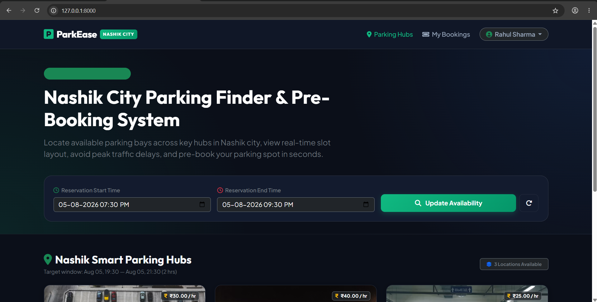
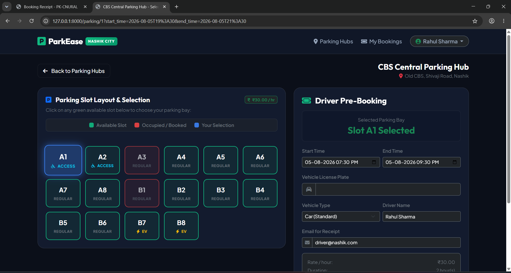
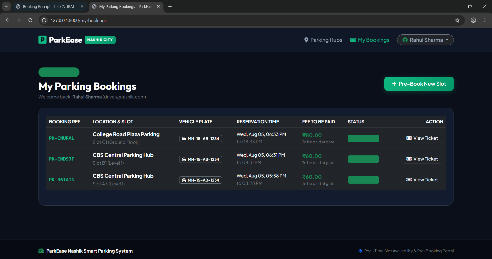

# 🚗 ParkEase Nashik - Smart City Parking Finder & Pre-Booking System

> A modern, responsive web application tailored for Nashik City to locate available parking bays across key city hubs, visualize slot layouts using a unified CSS Grid, and pre-book parking slots in advance.

---

## 🎯 Objective

ParkEase Nashik addresses urban parking congestion in Nashik City by providing drivers with real-time slot availability, temporal overlap conflict detection, Indian Rupee (₹) pricing calculations, and a driver dashboard with digital entry pass receipts.

Key features include:
- **Nashik Parking Hubs**: Seeded with major Nashik locations (CBS Central Parking Hub, College Road Plaza, Panchavati Smart Parking Plaza).
- **CSS Grid Slot Visualizer**: Unified slot layout visualizer displaying Regular, EV Charging, and Accessibility bays.
- **Conflict Prevention Engine**: Real-time interval overlap algorithm ensuring no double-booking for any slot.
- **Driver Authentication**: Login & Registration portal for drivers to manage their parking history.
- **Digital Entry Pass**: Generates a printable pass detailing total parking fee to be paid at the gate upon arrival.

---

## 🛠️ Technology Stack

- **Framework**: Laravel 12 (PHP 8.2+)
- **Database**: MySQL (XAMPP / phpMyAdmin)
- **ORM**: Laravel Eloquent ORM
- **Frontend**: HTML5, Vanilla CSS, CSS Grid Layout, Bootstrap 5, FontAwesome Icons
- **Authentication**: Laravel Session-Based Auth (`Illuminate\Foundation\Auth`)
- **Mailer**: Laravel Mailable HTML Email Templates

---

## ⚙️ Setup Instructions

### Prerequisites
- PHP >= 8.2
- Composer
- XAMPP (Apache & MySQL)

### Installation Steps

1. **Clone the Repository**
   ```bash
   git clone https://github.com/your-username/parkease-nashik.git
   cd parkease-nashik
   ```

2. **Install PHP Dependencies**
   ```bash
   composer install
   ```

3. **Configure Environment File**
   Create a `.env` file in the root directory (or copy `.env.example`):
   ```env
   APP_NAME=ParkEase
   APP_ENV=local
   APP_KEY=base64:GGLQAWehOSDBckSAzuRhSxNPkbf+tarGyIO3mV59Cqc=
   APP_URL=http://127.0.0.1:8000

   DB_CONNECTION=mysql
   DB_HOST=127.0.0.1
   DB_PORT=3306
   DB_DATABASE=parkease_nashik
   DB_USERNAME=root
   DB_PASSWORD=
   ```

4. **Start MySQL Service**
   - Open **XAMPP Control Panel**.
   - Click **Start** next to **MySQL**.

5. **Run Database Migrations & Seeders**
   This creates the database `parkease_nashik` and populates the Nashik parking hubs:
   ```bash
   php artisan migrate:fresh --seed
   ```

6. **Start Local Server**
   ```bash
   php artisan serve
   ```

---

## 🔑 Demo Login Credentials

- **Email**: `driver@nashik.com`
- **Password**: `password123`

---

## 🖼️ Screenshots

### 1. Driver "My Bookings" Dashboard


### 2. CSS Grid Parking Slot Visualizer


### 3. Digital Entry Pass Receipt


---

## 🌐 Live Link

- **Local Development Server**: [http://127.0.0.1:8000](http://127.0.0.1:8000)
